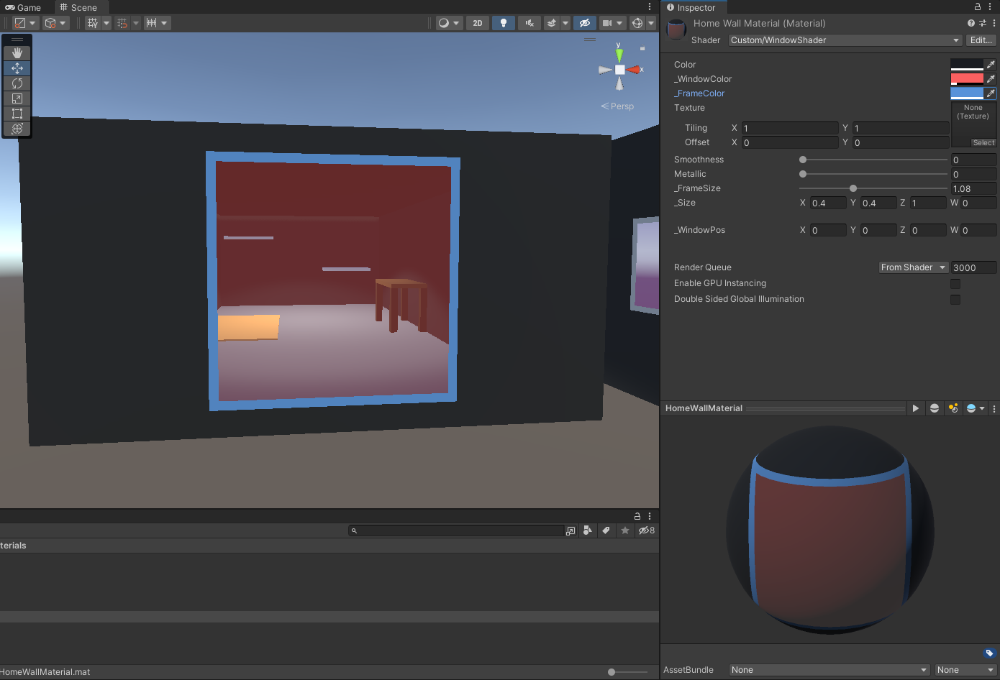

# WindowMaker
WindowMaker lets you create a window on any mesh you want with this shader.  
Inspired from Robert Thomson's video.  

You can download UnityPackage through Releases page  
 

Video  
https://youtu.be/cilrfB49c7w  

 
 

